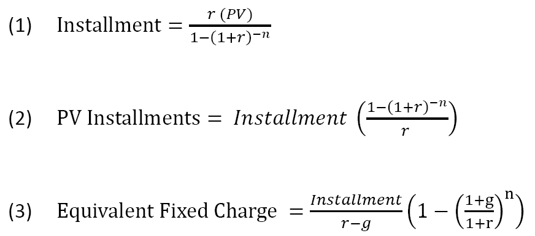

Would you rent or buy a home in the USA?
========================================================

author: aerasso

date: August 5, 2016

Description
========================================================
type:subsection

This calculator determines the present value of 
 - purchasing a residential property and 
 - renting the same property. 
 
It recommends which of the two options is more advantageous from a financial perspective.

This decision is often a large fraction of disposable income and the largest capital allocation that a person can ever make over life. 

If you are ready to start using the calculator please visit <https://aerasso.shinyapps.io/ShinyAppRE/>.

Usage
========================================================
type: subsection

1. In tab "Input Parameters" review the "Input and Calculated Values" . If correct then go to step 3, otherwise go to step 2.

2. On sidebar use the sliders to adjust the input values and press the "Update"" button. Go to step 1.

3. In tab "rent Buy Estimates" review tables with "Estimates of Periodic Values" and "Estimates of Present Value". Read the recommendations at the bottom.

Code
========================================================
type: alert

On the UI side the application gathers multiple parameters to determine the present value of purchasing a residential property or renting it. This same application makes a recommendation. 

Calculations are stored on the server side.

For more details on the code behind this calculator visit 

<https://github.com/aerasso/localRepoRE/blob/master/server.R>.

<https://github.com/aerasso/localRepoRE/blob/master/ui.R>

Formulas and Applications
========================================================
type: subsection

1. Mortgage Installment
2. Property insurance, repair maintenance, property tax, rent
3. All items in 2. for annual inflation (g) estimates
Down payment & closing costs are one time charges today

Opportunity cost is the sum of (items in 1. & 2.) * opportunity rate

